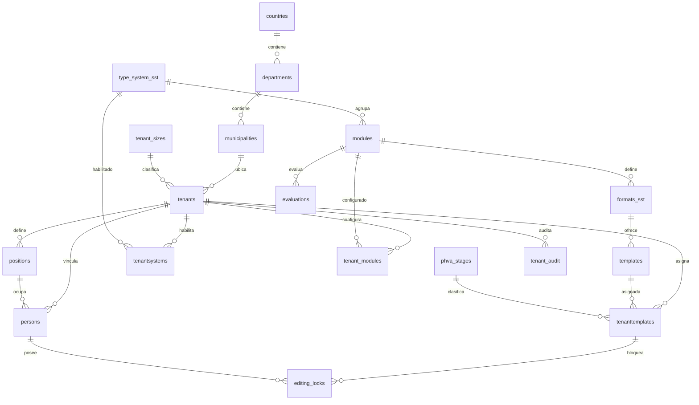

# Modelos y normalización SST/PESV

Los tres modelos tienen objetivos distintos: el lógico describe el negocio, el relacional fija relaciones y claves, y el físico describe las tablas reales de PostgreSQL 16. `Examen.md` es la fuente de requisitos; las cardinalidades no precisadas allí son decisiones de diseño explícitas.

## 1. Modelo lógico

Una **organización** tiene tamaño y ubicación, y reúne personas, cargos, sistemas habilitados, módulos habilitados y documentos asignados. Una persona ocupa un cargo de su misma organización. Un **sistema** SST o PESV agrupa módulos; cada módulo tiene formatos y evaluaciones, y cada formato tiene plantillas base. Una organización asigna una plantilla como **documento exigible** a una etapa **Planear, Hacer, Verificar o Actuar**. Cada asignación tiene un estado. Una persona puede mantener un bloqueo temporal sobre un documento de su propia organización. El historial de cambios principales de una organización se audita.

Cardinalidades principales: país 1:N departamento; departamento 1:N municipio; municipio 1:N organización; organización 1:N personas y cargos; sistema 1:N módulos; módulo 1:N formatos y evaluaciones; formato 1:N plantillas; organización M:N sistemas y módulos mediante relaciones separadas; organización M:N plantillas base mediante asignaciones documentales; etapa 1:N asignaciones; documento 1:N bloqueos históricos.

Reglas adoptadas: un cargo se identifica **dentro de su organización**; una plantilla solo se asigna una vez a la misma organización; una asignación tiene un único estado (`no_iniciado`, `borrador` o `finalizado`). Solo las plantillas asignadas cuentan como documentos exigibles.

## 2. Modelo relacional

Vista general del modelo:

Primer acercamiento para leer las tablas:

Segundo acercamiento:

Las relaciones y claves del diagrama son:

`countries(country_id PK, name AK)` → `departments(department_id PK, country_id FK, (country_id,name) AK)` → `municipalities(municipality_id PK, department_id FK, (department_id,name) AK)`.

`tenant_sizes(tenant_size_id PK, description AK)`; `tenants(tenant_id PK, identification AK, tenant_size_id FK, municipality_id FK)`; `positions((tenant_id,position_id) PK, tenant_id FK, (tenant_id,description) AK)`; `persons(person_id PK, (tenant_id,position_id) FK, (tenant_id,identification) AK, (tenant_id,email) AK)`.

`type_system_sst(system_id PK, code AK)` → `modules(module_id PK, system_id FK, (system_id,title) AK)` → `formats_sst(format_id PK, module_id FK, (module_id,title) AK)` → `templates(template_id PK, format_id FK, (format_id,title) AK)`; `evaluations(evaluation_id PK, module_id FK)`.

`phva_stages(stage_id PK, code AK)`; `tenantsystems((tenant_id,system_id) PK y dos FK)`; `tenant_modules((tenant_id,module_id) PK y dos FK)`; `tenanttemplates(tenanttemplate_id PK, (tenant_id,template_id) AK y FK hacia tenants, templates y phva_stages)`; `editing_locks(lock_id PK, tenanttemplate_id FK, person_id FK)`; `tenant_audit(audit_id PK)`. Un trigger verifica que el sistema del módulo esté habilitado y que la plantilla use un módulo habilitado; otro impide retirar el módulo si tiene documentos. Un tercer trigger comprueba que persona y documento del bloqueo pertenezcan a la misma organización.

**AK** = clave alternativa impuesta por `UNIQUE`. La FK compuesta de `persons` evita cargos de otra organización. Para relacionar cargo y persona se usan **ambas** columnas: `tenant_id` y `position_id`. `editing_locks` deriva la organización de sus dos FKs; no almacena un `tenant_id` redundante.

## 3. Modelo físico

El DDL definitivo está en [`init/01_schema.sql`](../init/01_schema.sql). El [diccionario](DICCIONARIO.md) enumera las 18 tablas y sus columnas, tipos, nulabilidad y valores predeterminados extraídos del catálogo real. Los objetos usan el esquema `sst`, identificadores `bigint GENERATED BY DEFAULT AS IDENTITY`, texto `text`, fechas con zona `timestamptz`, banderas `boolean` y porcentajes derivados `numeric`. `position_id` usa una secuencia para facilitar inserciones, pero solo la pareja `(tenant_id,position_id)` es clave declarada. `CHECK` limita códigos PHVA, estado documental y orden. Las FKs no usan borrado en cascada.

Índices adicionales: búsqueda por municipio y tamaño; personas por cargo; habilitaciones por módulo/sistema; documentos por organización, etapa y estado; bloqueos activos y vencimiento; auditoría por organización y fecha; vista materializada por organización y cumplimiento. Las PK y restricciones `UNIQUE` crean sus propios índices.

La [documentación oficial de DrawSQL](https://drawsql.app/docs/import-from-ddl) confirma que acepta DDL PostgreSQL. Para reproducir el diagrama, abre [modelo relacional.sql](modelo%20relacional.sql), copia todo su contenido y pégalo en **File → Import** de un diagrama PostgreSQL; después pulsa **Begin Import** y revisa el registro. El archivo contiene las 18 definiciones `CREATE TABLE` y sus índices, sin datos ni rutinas. Las capturas muestran la importación realizada por el estudiante; la comprobación de la FK compuesta `persons → positions` debe hacerse leyendo el DDL, porque la interfaz puede representar sus columnas de forma incompleta.

El diagrama siguiente ayuda a leer las relaciones físicas; no sustituye los tres modelos diferenciados arriba.

## 4. Normalización hasta 4FN

Las dependencias funcionales relevantes son: `country_id → name`; `department_id → country_id,name`; `municipality_id → department_id,name`; `tenant_id → identificación,nombre,tamaño,municipio,estado`; `(tenant_id,position_id) → descripción`; `person_id → tenant_id,position_id,identificación,nombres,correo`; `module_id → system_id,título,orden`; `template_id → format_id,título`; `(tenant_id,module_id) → habilitado,fecha`; `(tenant_id,template_id) → etapa,estado,fechas`; `lock_id → documento,persona,vencimiento,estado`. Las claves alternativas citadas en el modelo relacional determinan los mismos atributos de sus relaciones.

Las columnas contienen valores atómicos (**1FN**). Los atributos de relaciones con clave compuesta, como `tenant_modules.is_enabled`, dependen del par completo (**2FN**). Municipio, tamaño, sistema, módulo y formato se almacenan en catálogos propios; `tenanttemplates` no repite sistema, módulo o formato (**3FN**). Según las dependencias de negocio anteriores, todo determinante no trivial dentro de cada relación es una clave candidata (**BCNF**).

Para **4FN** se buscan conjuntos multivaluados *independientes*. La [definición académica de Stanford](https://i.stanford.edu/~ullman/fcdb/aut07/2006/lecture_notes/06-Normalization.html) exige que el determinante de toda dependencia multivaluada no trivial sea superclave. Imagine una tabla `organizacion_persona_modulo(tenant_id,person_id,module_id)`: Andes tiene tres personas y seis módulos, por lo que almacenaría `3 × 6 = 18` filas sin que exista una asignación real persona–módulo. Allí `tenant_id ↠ person_id` y `tenant_id ↠ module_id` son dependencias multivaluadas no triviales, y `tenant_id` no es superclave. La descomposición real usa `persons` y `tenant_modules`: tres filas de personas y seis asignaciones de módulos, sin combinaciones artificiales.

Sistemas habilitados, módulos y plantillas asignadas son hechos distintos; `tenantsystems`, `tenant_modules` y `tenanttemplates` los registran en relaciones separadas. Cada fila de `tenanttemplates` tiene una sola plantilla, etapa y estado. Cada fila de `editing_locks` es un evento concreto de bloqueo, no dos listas independientes. `editing_locks` ya no repite `tenant_id`: el trigger verifica por `JOIN` que persona y documento sean de la misma empresa. Por tanto, con las dependencias de negocio declaradas, ninguna relación conserva una dependencia multivaluada independiente no trivial con un determinante que no sea superclave: el modelo final cumple **4FN**.

La secuencia que genera `position_id` suele producir valores globalmente diferentes, pero el esquema **no declara** `position_id` como clave global: la clave es `(tenant_id,position_id)`. Dos organizaciones pueden usar el mismo número, caso comprobado en `docs/VERIFICACION.sql`. Si la regla de negocio cambiara y exigiera que `position_id` fuera globalmente único, habría que revisar de nuevo `persons.tenant_id`; no se debe afirmar 4FN bajo una dependencia distinta sin rediseñar el modelo.

El porcentaje de cumplimiento es `finalizados / total × 100`; si no hay documentos se presenta como 0. Se calcula en vistas. La vista materializada necesita `REFRESH MATERIALIZED VIEW` tras cambios.
